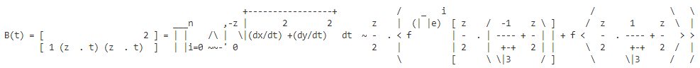
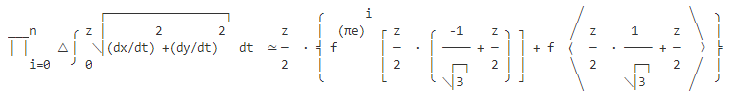

# Tex2utf

For when you need to convert your LaTeX maths to plain text, but you'd like the result to take advantage of the fact that Unicode is a thing, and infinitely better at creatively looking like maths syntax than plain ASCII can ever be.

This repo is a UTF8 massaging of the `tex2mail` tool (with some fixes around how brackets are constructed) for converting LaTeX maths to an easier to read, plain text form (for use in contexts that don't support graphical rendering).

The original can be found over on https://ctan.org/pkg/tex2mail.

## Usage

Place `tex2utf.pl` in a dir somewhere then invoke using perl as:

```
> perl path/to/tex2utf.pl inputfile.tex
```

**Note:** because this is an update to tex2mail to support UTF8, your environment should be set to utf8 encoding. If not, you're basically guaranteed to get `Wide character in print at ...` errors.

**Note 2:** the `newgetopt.pl` file that the original `tex2mail.pl` relies on is not required. The original needed it for perl 4 compatibility, but that's not been necessary for some 25 years now.


## LaTeX

Let's compare the result for the following (nonsense) LaTeX code:

```
\[
    B(t) =
    \begin{bmatrix}
      1 & (z \cdot t) & (z \cdot t)^2
    \end{bmatrix}
    =
    \prod_{i=0}^n
    \Delta
    \int_{0}^{z}\sqrt{ \left (dx/dt \right )^2+\left (dy/dt \right )^2} dt
    \simeq
    \frac{z}{2} \cdot
    \left \{
        f^{(\Pi e)^i}
        \left [
            \frac{z}{2} \cdot \left ( \frac{-1}{\sqrt{3}} + \frac{z}{2} \right )
        \right ]
        + f
        \left <
            \frac{z}{2} \cdot \frac{1}{\sqrt{3}} + \frac{z}{2}
        \right >
    \right \}
\]
```


## tex2mail result




## tex2utf result




## Todo's

I'd honestly love to get this turned into a Python script, because Perl programmers are a dying breed (I haven't worked with Perl in 20 years, so I spent way more time than I would have liked relearning how everything works) and having functions with actual named parameters is kind of nice if you want folks to understand what's going on and possibly help improve the code.

That said, if you feel this is something that can (finally) do what you need, and it's doing something wrong, and you know how to fix it (or you know where it's going wrong even if you don't know exactly how to fix it): file an issue, or even a PR, and let's get this tool updated to modern standards!

## How does this script work?

Kind of like TeX itself, really. It starts in the `paragraph` sub, and then run itself over and over until there's nothing left to expand/typset.

That said, it's been over 20 years since I last used Perl, and there are quite a few things that are "wrong" in this script that are revealed by adding `use warnings`... some of which require a deep understanding of the architecture underpinning the script's functioning. I'd have to perform code archeology to tease it apart, and unless someone wants to fund that effort, that is not something I'm going to be able to justify dedicating time to. At least not beyond trying to fix things that I need fixed for my own project(s). If you are a Perl 5 and Python 3 expert, and you want to help, please do let me know.

## Tests

There are no real tests right now, only some use-cases for some of the things I ran into while using tex2utf on my own content. Being able to turn those into unit tests would be pretty sweet though... got any ideas? Write your thoughts in an issue!
